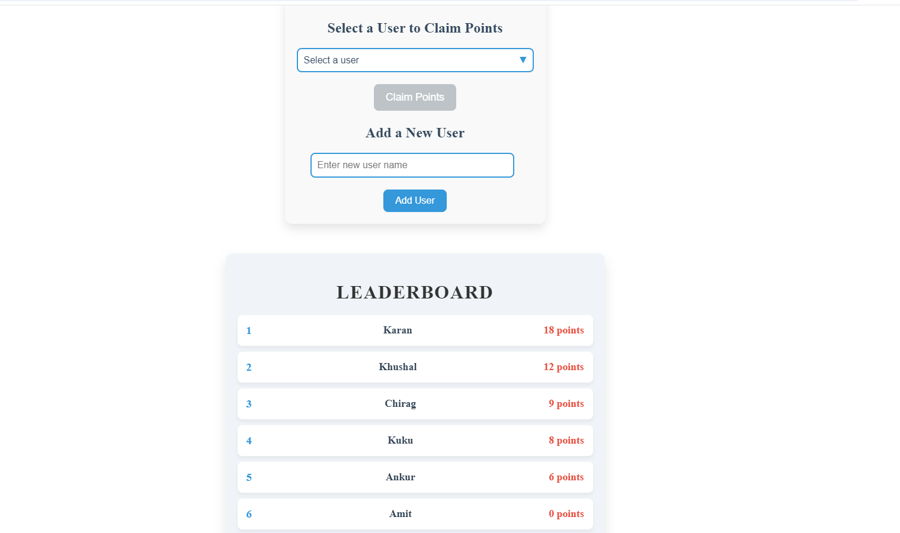

Leaderboard Project
Live Demo : https://leaderboard-projectt-frontend.vercel.app/

Project Overview
The Leaderboard Project is a dynamic web application that tracks and displays user rankings based on various metrics. It provides a simple and intuitive interface to view the top performers and their scores in real-time. The goal of this project is to offer a leaderboard solution that can be easily integrated into any platform, be it gaming, corporate, or academic environments.

Features
Real-Time Updates: Rankings and scores update dynamically without needing to refresh the page.
Responsive Design: Fully responsive layout optimized for both desktop and mobile devices.
Customizable: Easily adapt the leaderboard categories and score metrics based on requirements.
User-Friendly Interface: Simple and intuitive interface for seamless interaction.
Tech Stack
Frontend: React, CSS, 
Backend: Node.js, Express.js 
Database: MongoDB 
Deployment: Vercel
Installation and Setup
To run the project locally, follow these steps:

Clone the repository:
bash
Copy code
git clone https://github.com/Ritikdata12/leaderboard-proj.git
Navigate to the project directory:
bash
Copy code
cd leaderboard-project
Install dependencies:
bash
Copy code
npm install
Start the development server:
bash
Copy code
npm run dev
The app will now be running at http://localhost:5173.

How It Works
The leaderboard displays the top players, their scores, and ranks in a visually appealing format. Scores are updated dynamically, ensuring that users always see the most recent data without needing to refresh the page.

Contribution
Feel free to fork the repository and submit a pull request for any features or improvements you want to add. Contributions are welcome!

License
This project is open-source and available under the MIT License.

image 

